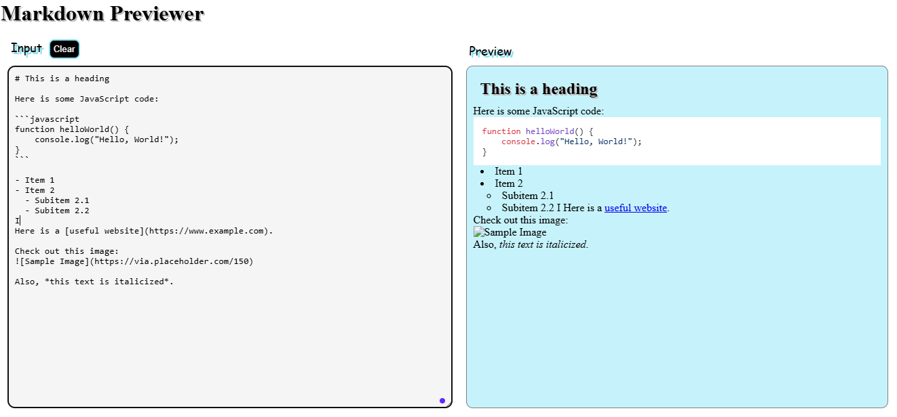

# Markdown Previewer

A simple web app to preview Markdown in real-time.

## Features
- A textarea where users can type Markdown syntax (on left-hand side)
- A preview section that displays the formatted output in real time (on right-hand side)
- Support for Markdown elements like:
    - Headings (# H1, ## H2, etc.)
    - Bold & Italics (**bold**, italic)
    - Links ([title](http://example.com))
    - Lists (ordered and unordered)
- A clear button to clear the textarea
- highlights

## Technologies Used
- HTML
- CSS
- JavaScript
- Marked.js
- Highlight.js

##  link
live : https://shweta-nigam.github.io/Markdown-previewer/
Repository : https://github.com/shweta-nigam/Markdown-previewer

## how It looks
